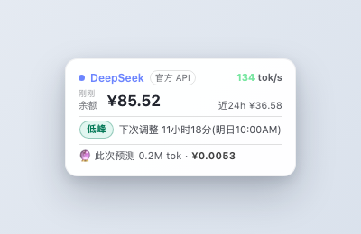

# dsh-cost-crystal 💎

DeepSeek Harness(`dsh web`) 的成本水晶球:余额、实时速率、波峰/低峰计费,以及 🔮 下一条消息消耗预测,全部时区感知。

English: *A cost & usage crystal ball for the DeepSeek Harness web GUI — balance, real-time rate, peak/off-peak billing, and a 🔮 next-message cost forecast, all timezone-aware.*

## 功能 / Features

- **🔮 下一条消息消耗预测**:基于当前对话上下文与历史用量,预估下一条消息的 token 消耗与费用;切换模型即时重新计价
- **余额卡片**:CNY/USD 余额 + 数据时效提示(「刚刚 / Ns前」),点击立即刷新
- **实时速率**:token 开始消耗 2s 内点亮动画,显示实时 `tok/s`
- **波峰/低峰计费**:时段徽章、切换倒计时、近 24h 消耗估算
- **即插即用**:零运行时依赖,深浅主题自适应,API key 只留在 Host

## 截图 / Screenshot



## 安装 / Installation

要求:DeepSeek Harness `web` profile(`@deepseek-ai/dsh`)。

```sh
# 方式一(推荐):npm 包
dsh plugin --profile web add dsh-cost-crystal

# 方式二(GitHub 源):从仓库直接装
dsh plugin --profile web add "github:xxvk/dsh-cost-crystal"

# 方式三(本地开发):本地目录
dsh plugin --profile web add /path/to/dsh-cost-crystal
```

然后重启 `dsh web`(bundle 层在启动时读取),浏览器硬刷新。包声明了 `dsh.bundle`,
`dsh plugin` 会自动把它挂进 profile 的 bundle 层,无需手动改配置。

## 计价口径与时区 / Pricing & Timezone

- 定价引擎已初步实现**官方政策时间表**:模型感知单价,波峰/低峰与平峰分桶,双币种(CNY/USD)。
- 峰谷(deepseek-v4-flash 等):波峰 命中 $0.014 / 未命中 $0.44 / 输出 $1.32(每百万 tokens),
  低峰为波峰半价;窗口 `01:00–04:00` 与 `06:00–10:00 UTC`。
- 时区:波峰窗口按 UTC 定义,状态判定与计价按 UTC;**展示**(切换时刻、本地波峰时段、倒计时)使用浏览器本地时区。
- 口径:消耗/费用仅统计**本机 Harness 会话**;换算汇率按固定 7.1(展示用)。
- 余额查询使用官方接口 `GET https://api.deepseek.com/user/balance`(API key)。
- ⚠️ 所有消耗/费用均为**本机日志估算**,可能与官方账单存在差异(缓存命中口径、历史费率变化等)。

## 开发 / Development

```sh
npm install           # (仅 typescript devDependency)
npm run build         # 生成注入脚本模板 + tsc → lib/
npm test              # 构建 + 全部测试 + 行数规则(TDD 门槛)
npm run build:profile # 生成本地 profile 热加载插件(开发时用)
```

架构:**Host 逻辑**(`src/index.ts` / `src/pricing.ts` / `src/usage.ts`)为 TypeScript;
**浏览器注入脚本**源为纯 JS(`src/scripts/card.inline.js` / `cost.inline.js`),由
`scripts/build-scripts.mjs` 转义生成 `src/card-script.ts` / `cost-script.ts`(生成物,禁止手改)。
**实现注意**:注入 index.html 必须用字符串切片拼接 —— `String.replace` 会把替换串中的
`$&` / `$'` / `$$` 按正则语义展开,破坏含 `$` 的脚本(早期版本踩过这个坑)。

## 测试 / Testing(TDD 门槛)

**每次修改代码后,必须完整通过才算完成:**

```sh
npm test    # = tsc 构建 + node --test(全部测试)+ check-lines 行数规则
```

- 框架:Node 内置 `node:test`(零运行时依赖);CI(`.github/workflows/test.yml`)push/PR 自动执行
- 覆盖:定价(时段/边界/费率/政策时间表)、用量聚合、注入脚本回归(`$` 与 `\n` 两个历史 bug)、
  插件 apply/路由(mock 服务)、活动增量检测、发布一致性(patch inject 与代码同步)
- 行数规则:源码与测试 ≤300 行(推荐)/ 400 行(硬上限);生成物 `lib/` 豁免。详见 [CONTRIBUTING.md](CONTRIBUTING.md)

## 路线图 / Roadmap

- v0.1.0(当前):余额卡片 + 波峰/低峰 + 倒计时 + 24h + 会话费用 + 实时速率 + 下一条预测(预览)
- v0.2.0(规划):**VL 模型统计** —— model 切换按钮 + 按模型分桶费用/token(deepseek vs qwen VL 等)
- v0.3.0(规划):预测深化 —— 加权窗口、烧尽预测、波峰提示、最贵请求、模型对比

详见 [ROADMAP_CN.md](ROADMAP_CN.md) 与 [TODO_CN.md](TODO_CN.md)。

## License

[Apache-2.0](LICENSE)
